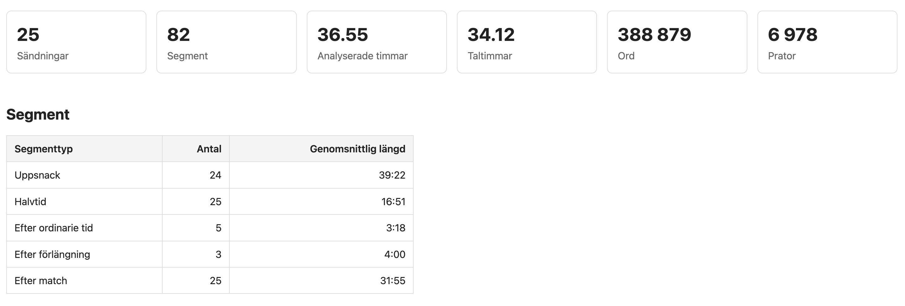
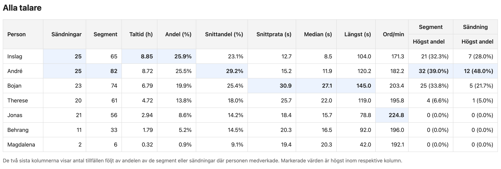
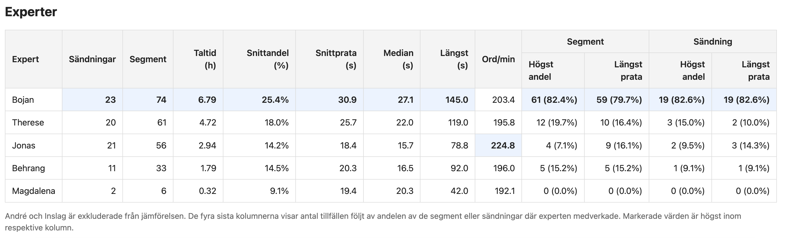
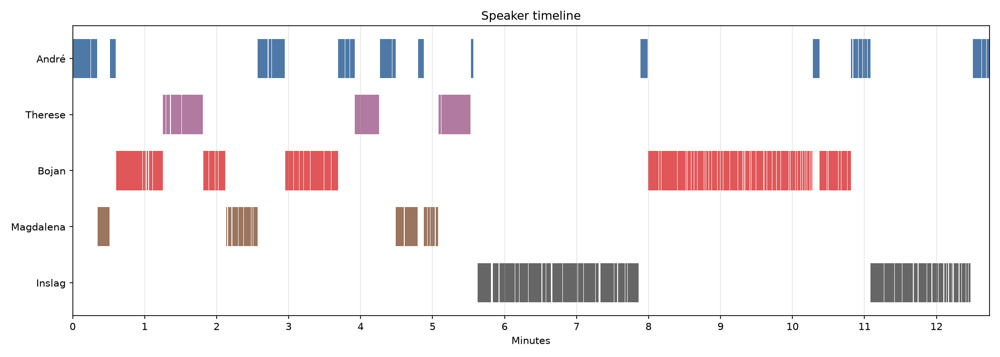

# Conversation Analytics for Sports Broadcasts

A Python tool for analysing conversational dynamics in audio using automatic 
speech recognition, speaker diarization and statistical analysis. It can be used to examine speakers
and how speaking time and turns are distributed across a conversation.

Created by Rebecca Stenberg.

Originally developed as a personal data analysis project to explore speaking patterns
in swedish football studio broadcasts, including whether
subjective viewer impressions of who dominates a discussion can be measured
quantitatively. 

The project combines MLX Whisper transcription, Pyannote speaker
diarization and a custom analysis pipeline to generate statistics, speaker timelines
and HTML reports.

## Features

- Automatic extraction of predefined broadcast segments
- Fast on-device speech transcription using MLX Whisper (Apple Silicon)
- Speaker diarization using Pyannote
- Interactive speaker identification
- Speaking time statistics
- Turn-based conversation metrics
- Speaker timeline visualizations
- HTML report generation
- Support for analyzing multiple broadcasts

## Example analysis

Summary statistics from SVT studio broadcasts during the FIFA World Cup 2026.

<p align="center">
  
  <br>
  <em>Overview of analysed broadcasts and studio segments.</em>
</p>

<p align="center">
  
  <br>
  <em>Speaking statistics for all participants, with interviews and prerecorded clips grouped into one category.</em>
</p>

<p align="center">
  
  <br>
  <em>Speaking statistics for studio experts across the analysed broadcasts.</em>
</p>

<p align="center">
  
  <br>
  <em>Speaker timeline from the halftime studio discussion during Sweden-Tunisia 15 June 2026.</em>
</p>

## Example workflow

```
Broadcast
    ↓
Segment extraction
    ↓
Speech transcription
    ↓
Speaker diarization
    ↓
Interactive speaker mapping
    ↓
Conversation analysis
    ↓
HTML report
```

## Metrics

The generated report currently includes:

- Total speaking time
- Share of total speaking time
- Number of words
- Number of speaking turns
- Average speaking turn
- Median speaking turn
- Longest speaking turn
- Words per minute
- Speaker timeline visualization

Metrics are presented both for the full broadcast and for each analysed segment.

## Installation

- Python 3.11+
- Apple Silicon Mac (recommended)

Clone the repository:

```bash
git clone git@github.com:rjstenberg/conversation-analytics.git
cd conversation-analytics
```

Create and activate a virtual environment:

```bash
python -m venv .venv
source .venv/bin/activate
```

### Python dependencies

Install the required Python packages:

```bash
pip install -r requirements.txt
```

### External tools

The project also requires:

- FFmpeg
- yt-dlp (optional, used by `new_broadcast.sh` to download publicly available broadcasts)

Install on macOS using Homebrew:

```bash
brew install ffmpeg yt-dlp
```

### Authentication

Speaker diarization uses Pyannote, which requires a Hugging Face account.

Before running the project:

1. Create a Hugging Face account.
2. Generate a User Access Token.
3. Accept the license for the required Pyannote model.
4. Authenticate locally:

```bash
huggingface-cli login
```

Paste your access token when prompted.

## Usage

### 1. Create a new broadcast

```bash
./scripts/new_broadcast.sh
```

The script will:

- download the audio (optional)
- create a new broadcast configuration
- prompt you to enter broadcast metadata

Afterwards, edit the generated JSON file and specify the start and end times for each segment.

### 2. Analyze the broadcast

```bash
./scripts/run_broadcast.sh <broadcast_id>
```

The pipeline automatically performs:

- segment extraction
- transcription
- speaker diarization
- interactive speaker mapping
- statistical analysis
- report generation

### 3. View the report

Open:

```
data/reports/<broadcast_id>/broadcast-report.html
```

### 4. Generate an overview analysis

After multiple broadcasts have been analyzed, generate the combined dataset and
statistics across all broadcasts:

```bash
python analysis/world_cup.py
python analysis/world_cup_statistics.py
python reporting/world_cup_report.py
```

This creates a tournament-level analysis combining the individual broadcast
results.

Open the generated overview report:

```text
data/reports/world-cup/world-cup-report.html
```

## Future work

Planned improvements include:

- Automatic speaker suggestions during speaker mapping
- Additional conversational metrics

## Notes

This repository contains the analysis software and example analysis output only.

Broadcast media, extracted audio segments and speech transcripts are intentionally
not included.

Users are responsible for ensuring they have the right to access and analyze any
media used with the software.

MLX Whisper occasionally produces hallucinated repetitions in noisy multilingual
segments. The pipeline removes the most obvious cases but does not attempt to
correct every transcription artifact.

Automatic language detection is used by default since broadcasts may contain
Swedish studio discussion, foreign-language interviews and multilingual inserts.

## Acknowledgements

Built using:

- MLX Whisper
- Pyannote
- FFmpeg
- yt-dlp

ChatGPT was used during development for programming support, debugging,
architectural discussions and code review.
